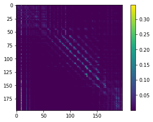
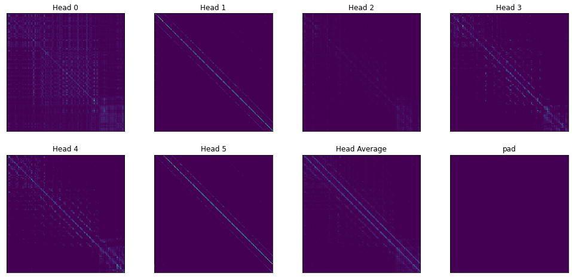
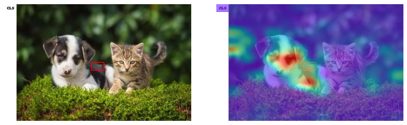

# Visualizer


Visualizer是一个辅助深度学习模型中Attention模块可视化的小工具，主要功能是帮助取出嵌套在模型深处的Attention Map

## 为什么需要Visualizer?
为了可视化Attention Map，你是否有以下苦恼
* Return大法好：通过return将嵌套在模型深处的Attention Map一层层地返回回来，然后训练模型的时候又不得不还原
* 全局大法好：使用全局变量在Attention函数中直接记录Attention Map，结果训练的时候忘改回来导致OOM

不管你有没有，反正我有

咨询了专业人士的意见后，发现pytorch有个hook可以取出中间结果，大概查了一下，发现确实可以取出中间变量，但需要进行如下类似的hook注册
```python
handle = net.conv2.register_forward_hook(hook)
```
进行这样操作的前提是我们知道要取出来的模块名，但是Transformer类模型一般是这样定义的(以Vit为例)
```python
class VisionTransformer(nn.Module):
    def __init__(self, *args, **kwargs):
        ...
        self.blocks = nn.Sequential(*[Block(...) for i in range(depth)])
        ...
```
然后每个`Block`中都有一个Attention
```python
class Block(nn.Module):
    def __init__(self, *args, **kwargs):
        ...
        self.attn = Attention(...)
        ...
```
如果要使用hooks其中的问题就是
1. 嵌套太深，模块名不清晰，我们根本不知道我们要取的attention map怎么以model.bla.bla.bla这样一直点出来！
2. 一般来说，Transformer中attention map每层都有一个，一个个注册实在太麻烦了

所以我就思考并查找能否通过更简洁的方法来得到Attention Map（尤其是Transformer的）,而visualizer就是其中的一种，它具有以下特点
* 精准直接，你可以取出任何变量名的模型中间结果
* 快捷方便，同时取出Transformer类模型中的所有attention map
* 非侵入式，你无须修改函数内的任何一行代码
* 训练-测试一致，可视化完成后，你无须在训练时再将代码改回来

## 用法
### 安装
```shell
pip install bytecode
python setup.py install
```

安装完成后，只需要用get_local装饰一下Attention的函数，forward之后就可以拿到函数内与装饰器参数同名的局部变量啦~
### Usage1
比如说，我想要函数里的`attention_map`变量：
在模型文件里，我们这么写
```python
from visualizer import get_local
@get_local('attention_map')
def your_attention_function(*args, **kwargs):
    ...
    attention_map = ... 
    ...
    return ...
```
然后在可视化代码里，我们这么写
```python
from visualizer import get_local
get_local.activate() # 激活装饰器
from ... import model # 被装饰的模型一定要在装饰器激活之后导入！！

# load model and data
...
out = model(data)

cache = get_local.cache # ->  {'your_attention_function': [attention_map]}
```
最终就会以字典形式存在`get_local.cache`里，其中key是你的函数名,value就是一个存储attention_map的列表

### Usage2
使用Pytorch时我们往往会将模块定义成一个类，此时也是一样只要装饰类内计算出attention_map的函数即可
```python
from visualizer import get_local

class Attention(nn.Module):
    def __init__(self):
        ...
    
    @get_local('attn_map')
    def forward(self, x):
        ...
        attn_map = ...
        ...
        return ...
```
其他细节请参考[demo.ipynb](https://nbviewer.jupyter.org/github/luo3300612/Visualizer/blob/main/demo.ipynb)文件
## 可视化结果
这里是部分可视化vit_small的结果，全部内容在[demo.ipynb](https://nbviewer.jupyter.org/github/luo3300612/Visualizer/blob/main/demo.ipynb)文件里

因为普通Vit所有Attention map都是在Attention.forward中计算出来的，所以只要简单地装饰一下这个函数，我们就可以同时取出vit中12层Transformer的所有Attention Map！

一个Head的结果



一层所有Heads的结果



某个grid的Attention Map



## 注意
* 想要可视化的变量在函数内部不能被后续的同名变量覆盖了，因为get_local取的是对应名称变量在函数中的**最终值**
* 进行可视化时，get_local.activate()一定要在导入模型**前**完成，因为python装饰器是在导入时执行的
* 训练时你不需要修改/删除任何代码，即不用删掉装饰函数的代码，因为在get_local.activate()没有执行的情况下，attention函数不会被装饰，故没有任何性能损失(同上一点，因为python装饰器是在导入时执行的)

## 其他
当然，其实get_local本身可以取出任何一个函数中某个局部变量的最终值，所以它应该还有其他更有趣的用途

## references
* [bytecode](https://blog.csdn.net/qfcy_/article/details/118890362)
* [local track1](https://stackoverflow.com/questions/52313851/how-can-i-track-the-values-of-a-local-variable-in-python)
* [local track2](https://stackoverflow.com/questions/19326004/access-a-function-variable-outside-the-function-without-using-global)
* [decorator1](https://stackoverflow.com/questions/1367514/how-to-decorate-a-method-inside-a-class)
* [decorator2](https://stackoverflow.com/questions/6676015/class-decorators-vs-function-decorators)
